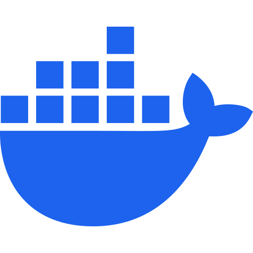
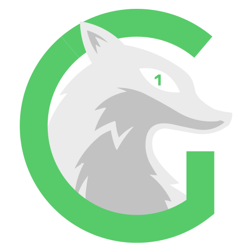
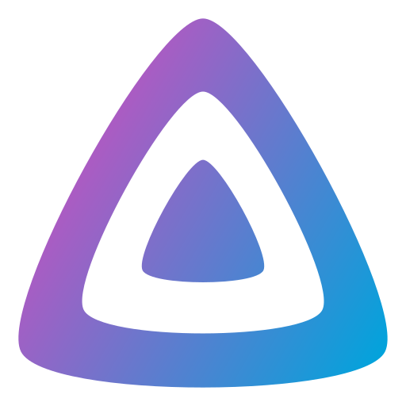
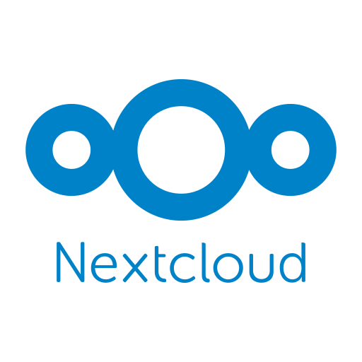
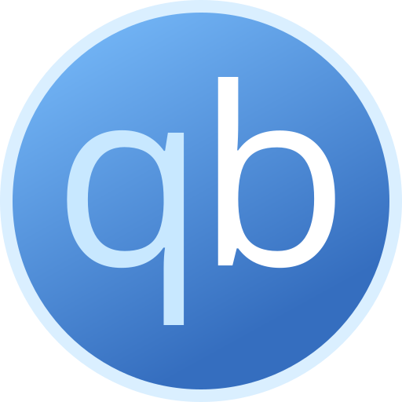
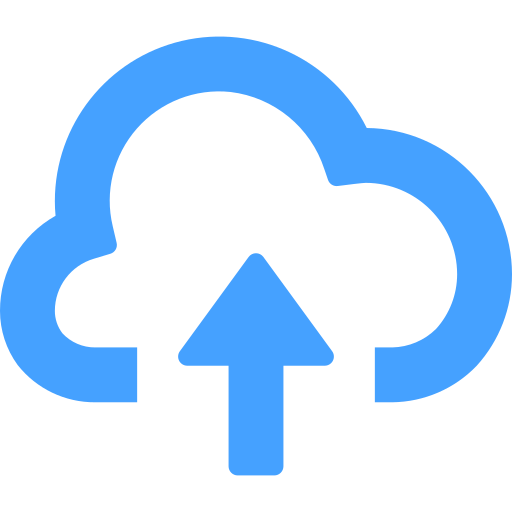

# Logos

Some services require a logo to be displayed in the UI. This directory contains logos for the services that are running on Helion. The logos are sourced from original `.svg` files and converted to `.png` with the dimensions of 512x512 pixels.

Below are the currently available logos.

          
