# Logos

Some services require a logo to be displayed in the UI. This directory contains all logos used in my homelab. The logos are sourced from original `.svg` files and converted to `.png` with the dimensions of 512x512 pixels.

Below are the currently available logos.

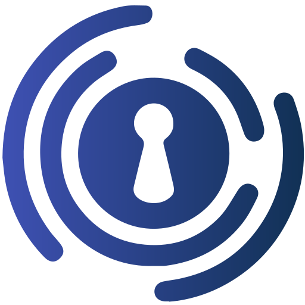 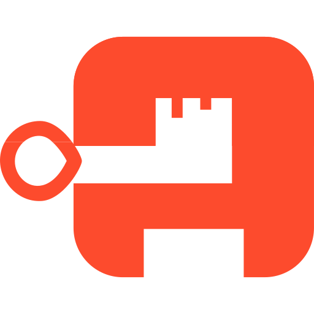 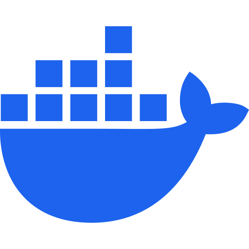   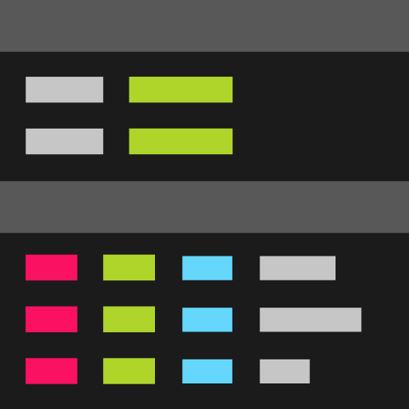 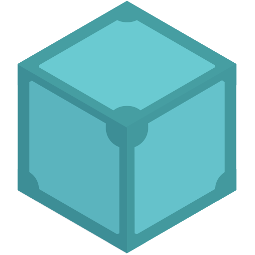 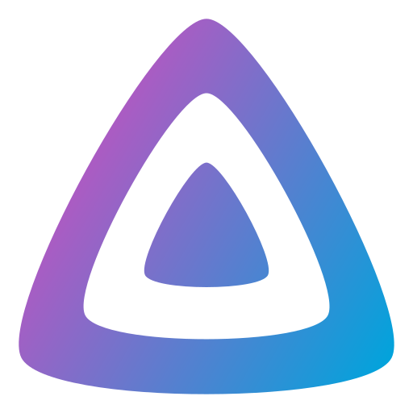 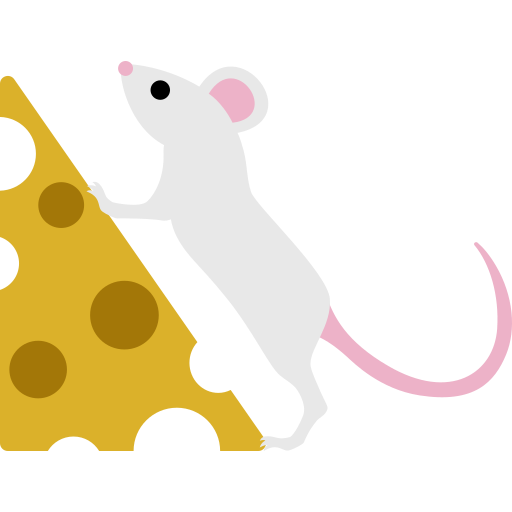   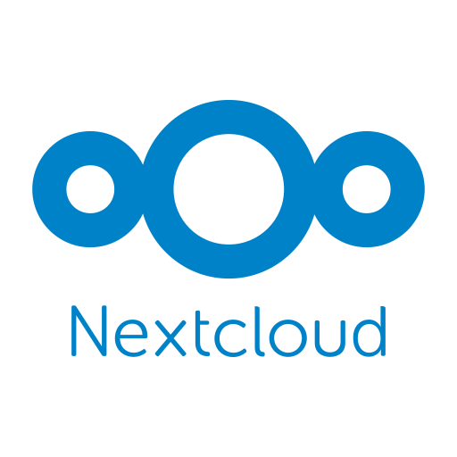  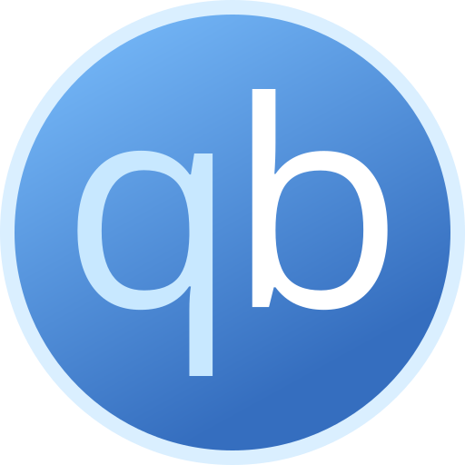 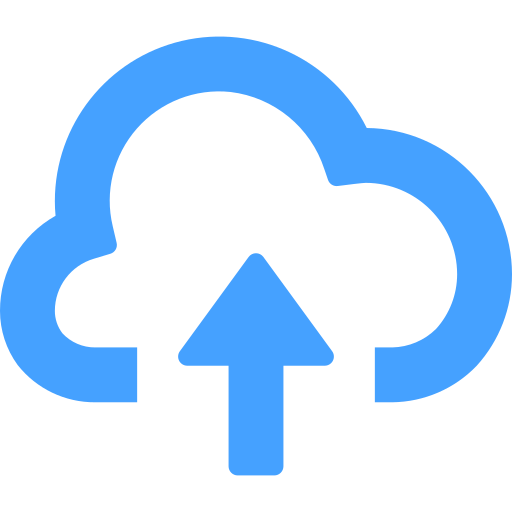 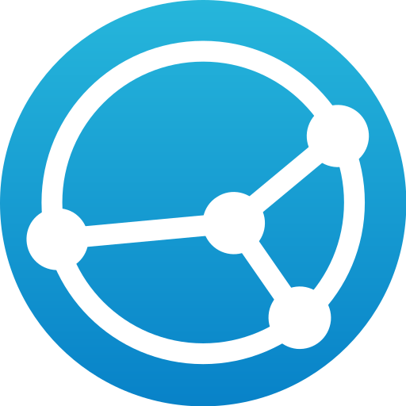 

Some logos were sourced from <https://github.com/loganmarchione/homelab-svg-assets>.
