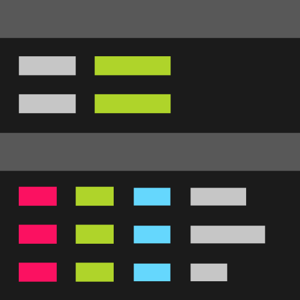
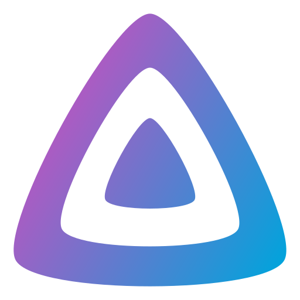
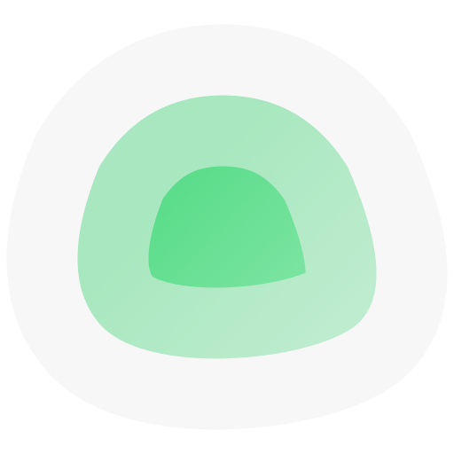

# Phantom

Phantom is my newest homelab server. It replaces Helion.

It's managed entirely via Docker Compose. It uses Caddy as a reverse proxy for its simplicity and it's protected by Anubis, Authentik and Fail2Ban. Some parts are open to the public, such as Kubo, Leanish and Send.

## Software

|                                                                                          | Service                                                   | Protection | About                                                                                                                            |
| :--------------------------------------------------------------------------------------- | :-------------------------------------------------------- | :--------- | :------------------------------------------------------------------------------------------------------------------------------- |
|  | [Anubis](https://github.com/TecharoHQ/anubis)             |            | Weighs the soul of incoming HTTP requests to stop AI crawlers                                                                    |
|  | [Authentik](https://github.com/goauthentik/authentik)     | Anubis     | The authentication glue you need                                                                                                 |
|  | [Beszel](https://github.com/henrygd/beszel)               | Authentik  | Lightweight server monitoring hub with historical data, docker stats, and alerts                                                 |
|  | [Caddy](https://github.com/caddyserver/caddy)             |            | Fast and extensible multi-platform HTTP/1-2-3 web server with automatic HTTPS                                                    |
|  | [Dozzle](https://github.com/amir20/dozzle)                | Authentik  | Realtime log viewer for containers                                                                                               |
|  | [Glances](https://github.com/nicolargo/glances)           | Authentik  | Glances an Eye on your system                                                                                                    |
|  | [GoAccess](https://github.com/allinurl/goaccess)          | Authentik  | GoAccess is a real-time web log analyzer and interactive viewer that runs in a terminal in \*nix systems or through your browser |
|  | [Jellyfin](https://github.com/jellyfin/jellyfin)          | Authentik  | The Free Software Media System                                                                                                   |
|  | [Kubo](https://github.com/ipfs/kubo)                      |            | An IPFS implementation in Go                                                                                                     |
|  | [Leanish](https://github.com/NatoBoram/leanish)           | Anubis     | A lean-ish web client for Lemmy                                                                                                  |
|  | [MeTube](https://github.com/alexta69/metube)              | Authentik  | Self-hosted YouTube downloader                                                                                                   |
|  | [MySpeed](https://github.com/gnmyt/myspeed)               | Authentik  | A speed test analysis software that shows your internet speed for up to 30 days                                                  |
|  | [Nextcloud](https://github.com/nextcloud/server)          |            | A safe home for all your data                                                                                                    |
|  | [Ollama](https://github.com/ollama/ollama)                | Basic Auth | Get up and running with large language models                                                                                    |
|  | [qBittorrent](https://github.com/qbittorrent/qBittorrent) | Authentik  | A BitTorrent client                                                                                                              |
|  | [Send](https://gitlab.com/timvisee/send)                  | Anubis     | Simple, private file sharing                                                                                                     |
|  | [Syncthing](https://github.com/syncthing/syncthing)       | Authentik  | Open Source Continuous File Synchronization                                                                                      |
|  | [Uptime Kuma](https://github.com/louislam/uptime-kuma)    | Authentik  | A fancy self-hosted monitoring tool                                                                                              |
|  | [Watchtower](https://github.com/containrrr/watchtower)    |            | A process for automating Docker container base image updates                                                                     |

## Hardware

[PCPartPicker Part List](https://ca.pcpartpicker.com/list/VPDrt3)

| Type               | Item                                                                                                                                                                                                                 |
| :----------------- | :------------------------------------------------------------------------------------------------------------------------------------------------------------------------------------------------------------------- |
| **CPU**            | [AMD Ryzen 7 9800X3D 4.7 GHz 8-Core Processor](https://ca.pcpartpicker.com/product/fPyH99/amd-ryzen-7-9800x3d-47-ghz-8-core-processor-100-1000001084wof)                                                             |
| **CPU Cooler**     | [Noctua NH-D9L chromax.black 46.44 CFM CPU Cooler](https://ca.pcpartpicker.com/product/KQMMnQ/noctua-nh-d9l-chromaxblack-4644-cfm-cpu-cooler-nh-d9l-chromaxblack)                                                    |
| **Motherboard**    | [MSI MPG X670E CARBON WIFI ATX AM5 Motherboard](https://ca.pcpartpicker.com/product/rmbTwP/msi-mpg-x670e-carbon-wifi-atx-am5-motherboard-mpg-x670e-carbon-wifi)                                                      |
| **Memory**         | [Kingston FURY Beast 64 GB (2 x 32 GB) DDR5-4800 CL38 Memory](https://ca.pcpartpicker.com/product/7YxRsY/kingston-fury-beast-64-gb-2-x-32-gb-ddr5-4800-cl38-memory-kf548c38bbk2-64)                                  |
| **Memory**         | [Kingston FURY Beast 64 GB (2 x 32 GB) DDR5-4800 CL38 Memory](https://ca.pcpartpicker.com/product/7YxRsY/kingston-fury-beast-64-gb-2-x-32-gb-ddr5-4800-cl38-memory-kf548c38bbk2-64)                                  |
| **Storage**        | [Samsung 990 Pro 4 TB M.2-2280 PCIe 4.0 X4 NVME Solid State Drive](https://ca.pcpartpicker.com/product/RKYmP6/samsung-990-pro-4-tb-m2-2280-pcie-40-x4-nvme-solid-state-drive-mz-v9p4t0bw)                            |
| **Video Card**     | [Gigabyte GAMING OC Radeon RX 7700 XT 12 GB Video Card](https://ca.pcpartpicker.com/product/VTFmP6/gigabyte-gaming-oc-radeon-rx-7700-xt-12-gb-video-card-gv-r77xtgaming-oc-12gd)                                     |
| **Case**           | [Phanteks Enthoo Pro 2 Server Edition ATX Full Tower Case](https://ca.pcpartpicker.com/product/FQGhP6/phanteks-enthoo-pro-2-server-edition-atx-full-tower-case-ph-es620pc_bk02)                                      |
| **Power Supply**   | [Corsair HX1200i 1200 W 80+ Platinum Certified Fully Modular ATX Power Supply](https://ca.pcpartpicker.com/product/fGgrxr/corsair-hx1200i-1200-w-80-platinum-certified-fully-modular-atx-power-supply-cp-9020281-na) |
| **Case Fan**       | [Noctua S12A PWM chromax.black.swap 63.27 CFM 120 mm Fan](https://ca.pcpartpicker.com/product/CKFXsY/noctua-nf-s12a-pwm-chromaxblackswap-633-cfm-120mm-fan-nf-s12a-pwm-chromaxblackswap)                             |
| **Case Fan**       | [Noctua S12A PWM chromax.black.swap 63.27 CFM 120 mm Fan](https://ca.pcpartpicker.com/product/CKFXsY/noctua-nf-s12a-pwm-chromaxblackswap-633-cfm-120mm-fan-nf-s12a-pwm-chromaxblackswap)                             |
| **Case Fan**       | [Noctua S12A PWM chromax.black.swap 63.27 CFM 120 mm Fan](https://ca.pcpartpicker.com/product/CKFXsY/noctua-nf-s12a-pwm-chromaxblackswap-633-cfm-120mm-fan-nf-s12a-pwm-chromaxblackswap)                             |
| **Case Fan**       | [Noctua S12A PWM chromax.black.swap 63.27 CFM 120 mm Fan](https://ca.pcpartpicker.com/product/CKFXsY/noctua-nf-s12a-pwm-chromaxblackswap-633-cfm-120mm-fan-nf-s12a-pwm-chromaxblackswap)                             |
| **Case Fan**       | [Noctua S12A PWM chromax.black.swap 63.27 CFM 120 mm Fan](https://ca.pcpartpicker.com/product/CKFXsY/noctua-nf-s12a-pwm-chromaxblackswap-633-cfm-120mm-fan-nf-s12a-pwm-chromaxblackswap)                             |
| **Case Fan**       | [Noctua S12A PWM chromax.black.swap 63.27 CFM 120 mm Fan](https://ca.pcpartpicker.com/product/CKFXsY/noctua-nf-s12a-pwm-chromaxblackswap-633-cfm-120mm-fan-nf-s12a-pwm-chromaxblackswap)                             |
| **Case Fan**       | [Noctua S12A PWM chromax.black.swap 63.27 CFM 120 mm Fan](https://ca.pcpartpicker.com/product/CKFXsY/noctua-nf-s12a-pwm-chromaxblackswap-633-cfm-120mm-fan-nf-s12a-pwm-chromaxblackswap)                             |
| **Case Fan**       | [Noctua S12A PWM chromax.black.swap 63.27 CFM 120 mm Fan](https://ca.pcpartpicker.com/product/CKFXsY/noctua-nf-s12a-pwm-chromaxblackswap-633-cfm-120mm-fan-nf-s12a-pwm-chromaxblackswap)                             |
| **Case Fan**       | [Noctua A14 PWM chromax.black.swap 82.52 CFM 140 mm Fan](https://ca.pcpartpicker.com/product/sWM323/noctua-nf-a14-pwm-chromaxblackswap-825-cfm-140mm-fan-nf-a14-pwm-chromaxblackswap)                                |
| **Case Fan**       | [Noctua A14 PWM chromax.black.swap 82.52 CFM 140 mm Fan](https://ca.pcpartpicker.com/product/sWM323/noctua-nf-a14-pwm-chromaxblackswap-825-cfm-140mm-fan-nf-a14-pwm-chromaxblackswap)                                |
| **Case Fan**       | [Noctua A14 PWM chromax.black.swap 82.52 CFM 140 mm Fan](https://ca.pcpartpicker.com/product/sWM323/noctua-nf-a14-pwm-chromaxblackswap-825-cfm-140mm-fan-nf-a14-pwm-chromaxblackswap)                                |
| **Fan Controller** | [Noctua NA-FH1 Fan Controller](https://ca.pcpartpicker.com/product/mHYRsY/noctua-na-fh1-fan-controller-na-fh1)                                                                                                       |
| **Fan Controller** | [Noctua NA-FH1 Fan Controller](https://ca.pcpartpicker.com/product/mHYRsY/noctua-na-fh1-fan-controller-na-fh1)                                                                                                       |
